# c64

Commodore C64 research and development.

- ```ANSI C``` development in ```cc65```
- ```DASM``` assembler for assembly language
- ```BASIC 2.0```

## Runtime

For development purposes use ```VICE``` emulator. Running on real hardware is preferable as usual. Should either connect computer thru RF to TV set or use s-video connection to some USB frame grabber on PC, which seems to be the most comfortable way. ```VirtualDub``` does the job.

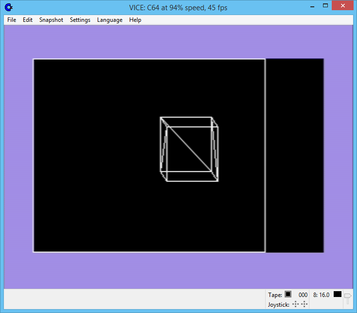

## Objectives

Graphics and audio programming. If possible, using ```generic``` as reference.

## Restoration

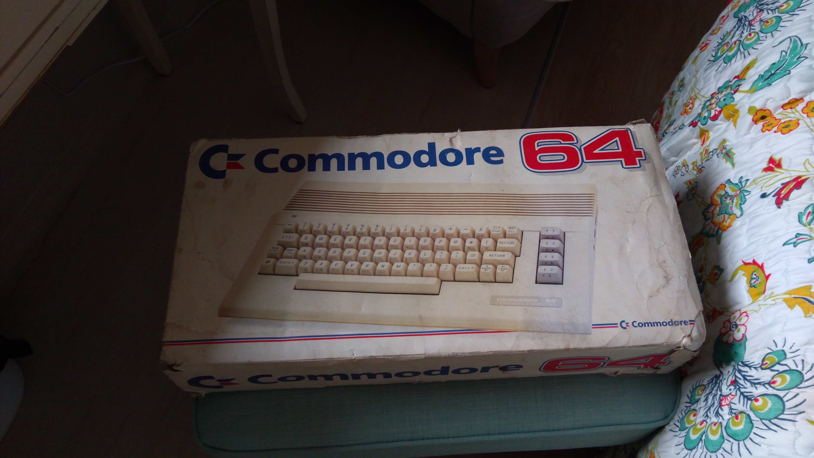

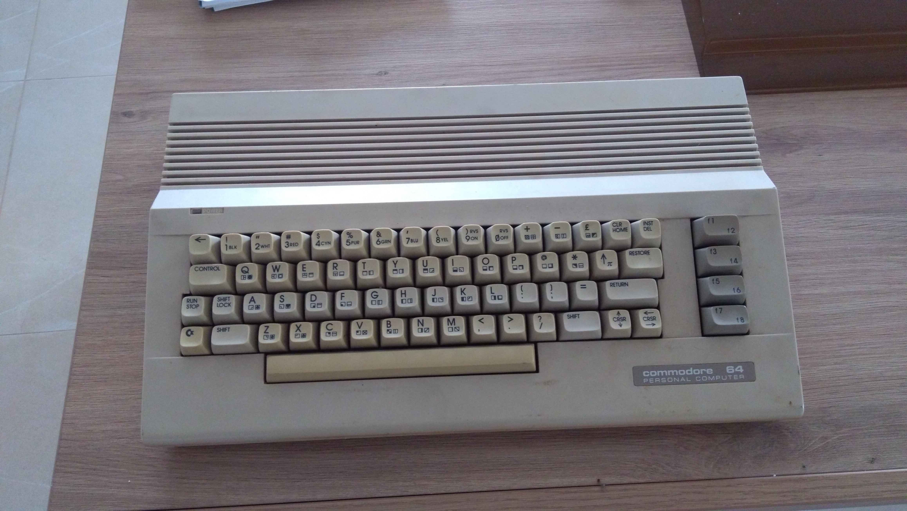

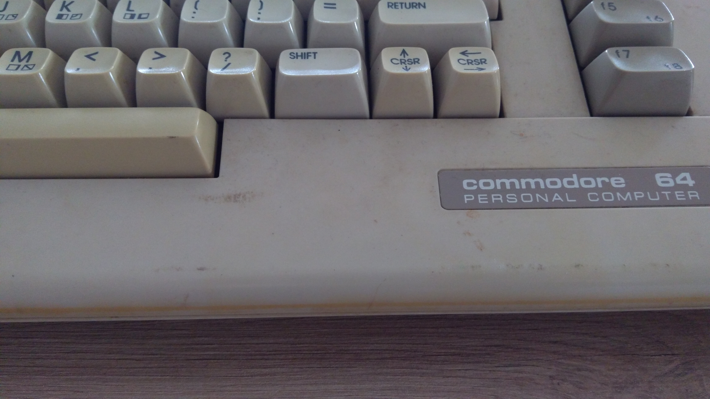

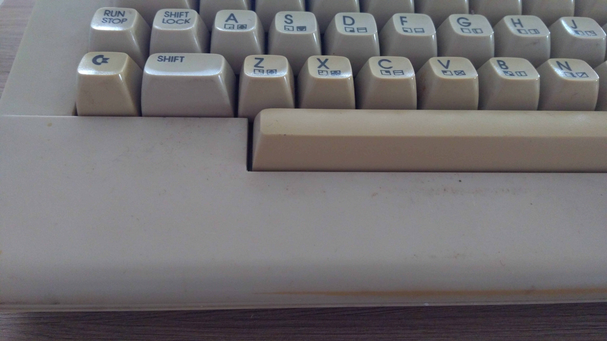

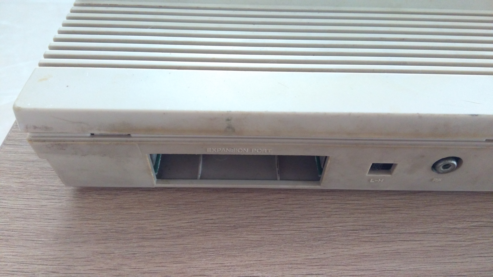

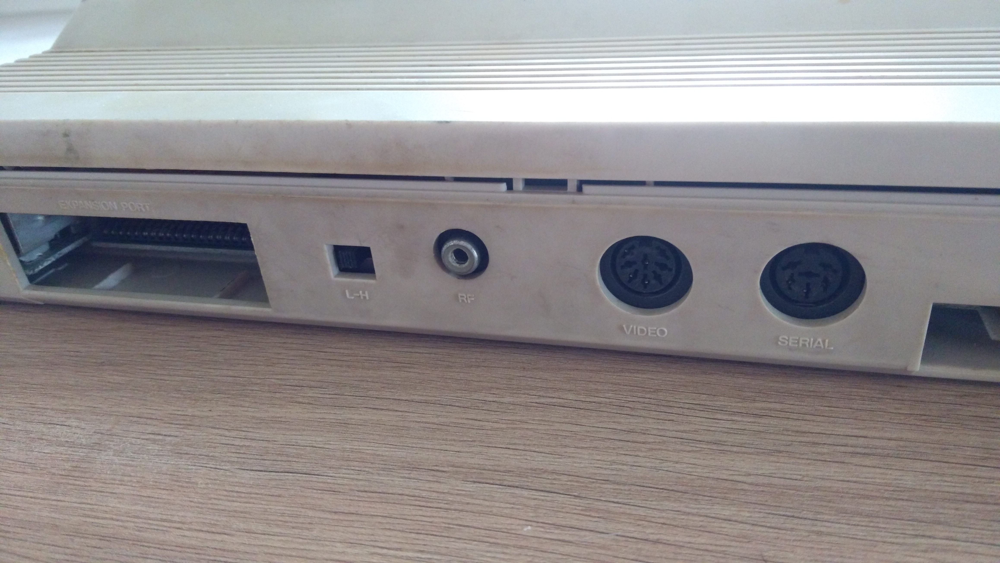

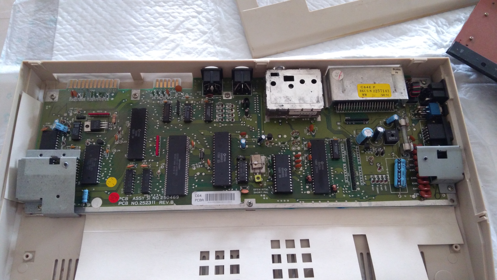

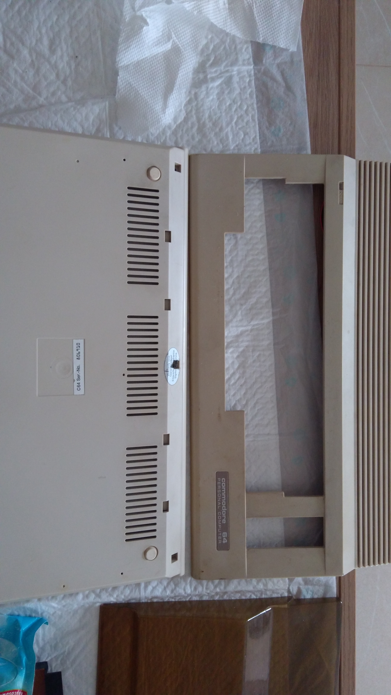

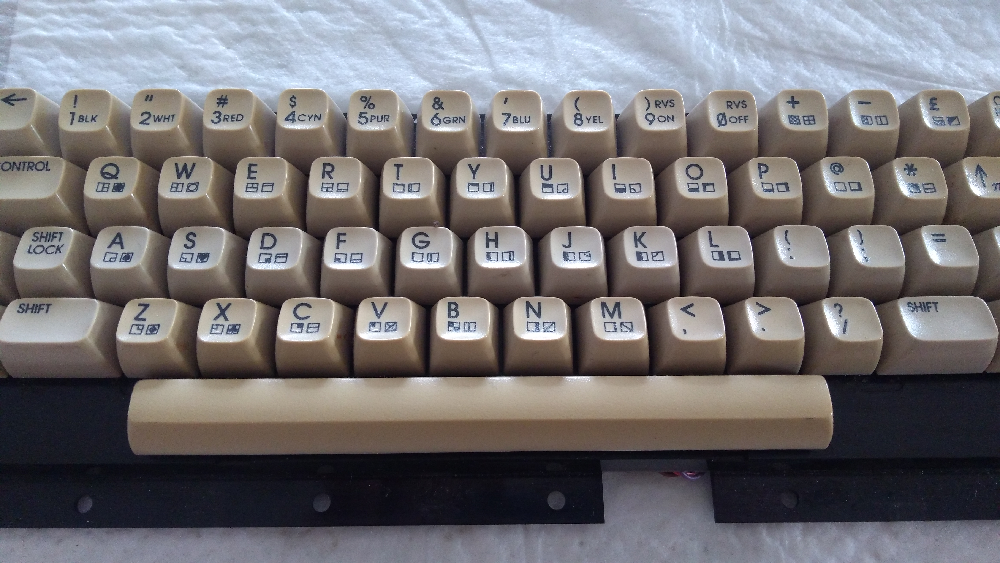

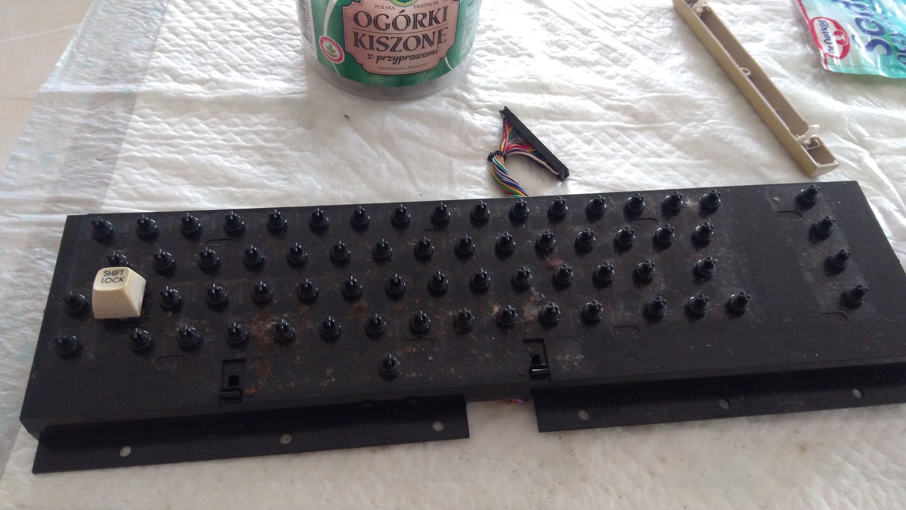


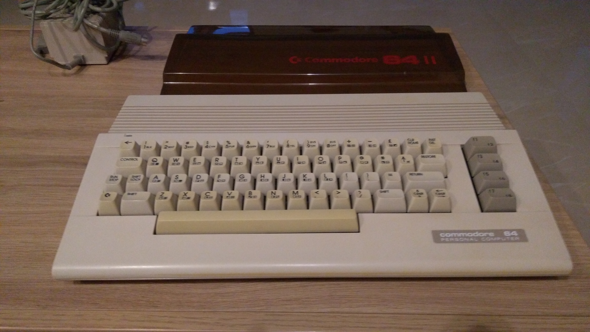

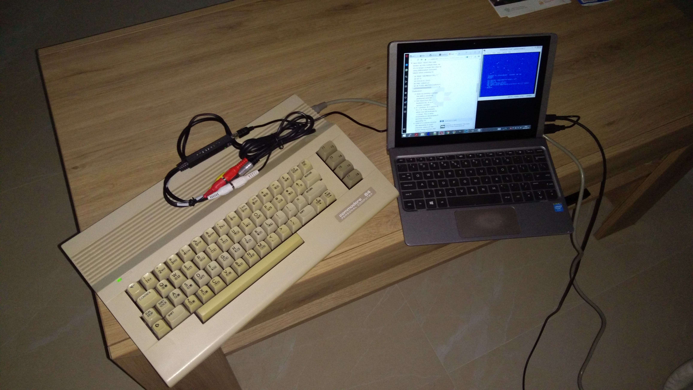

